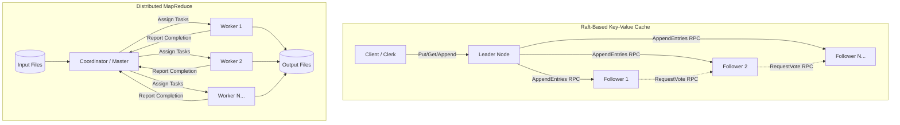
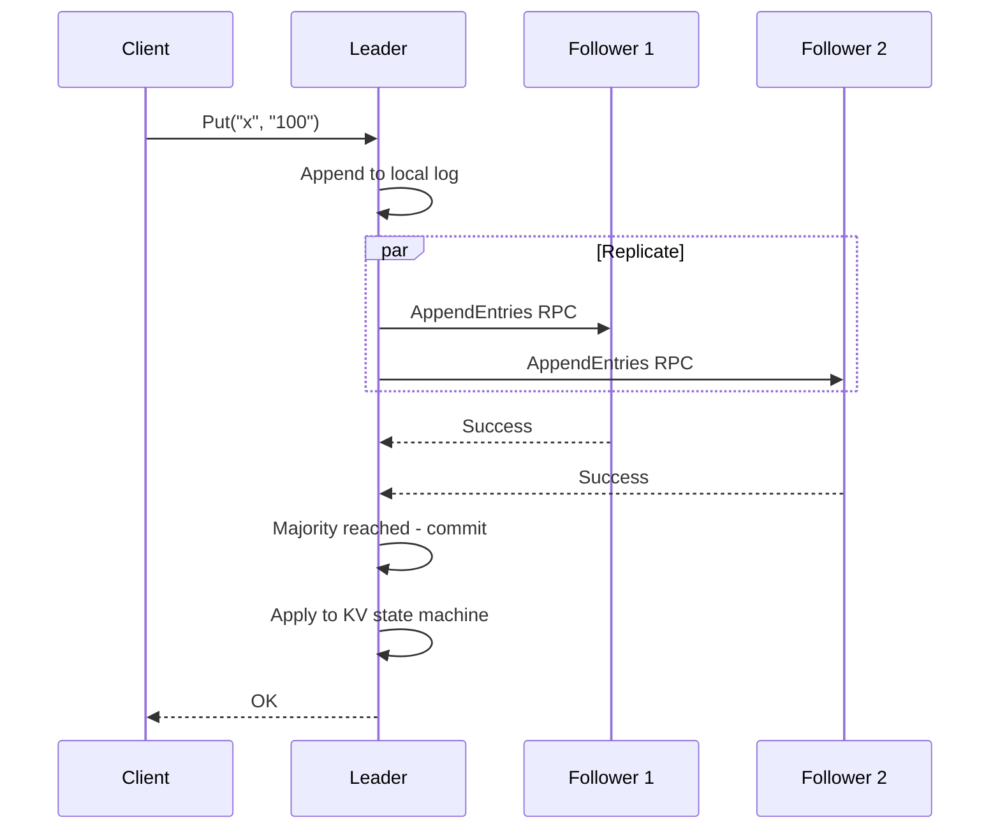
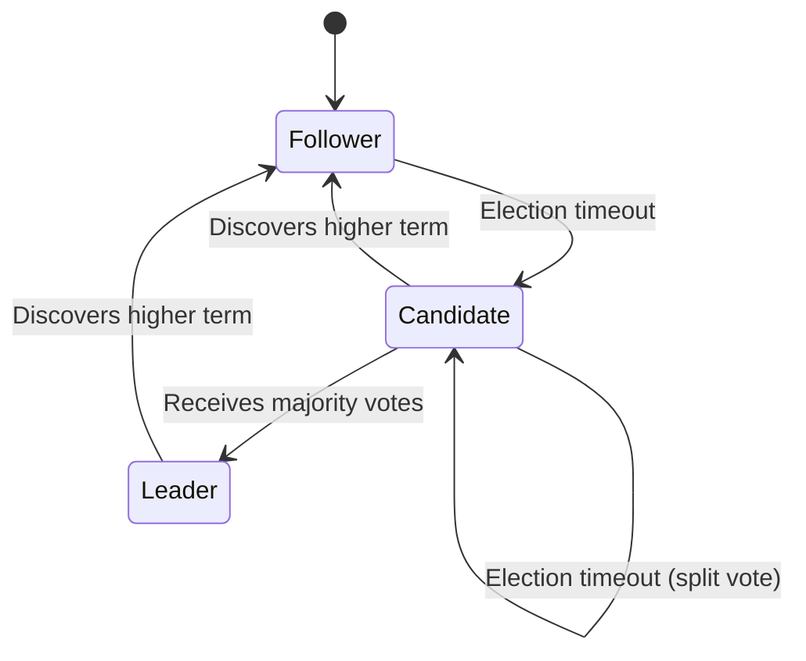
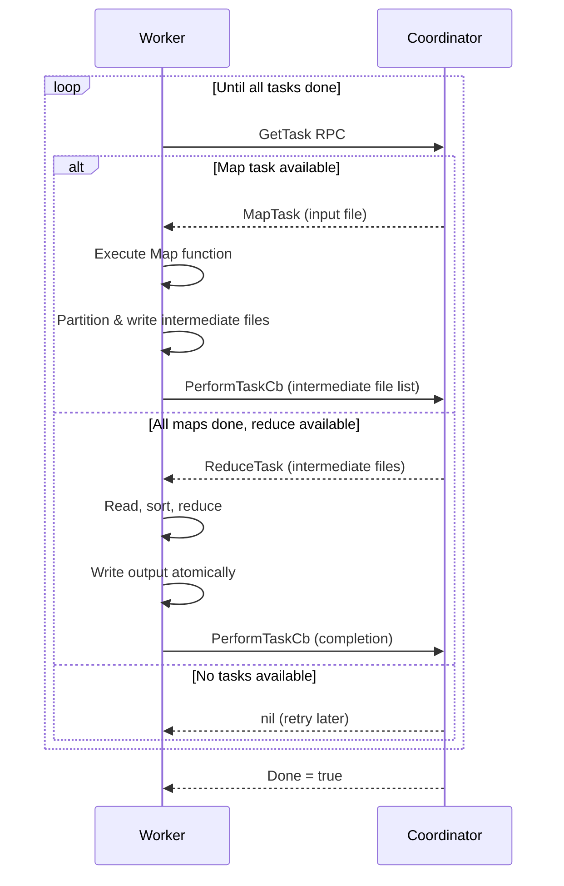
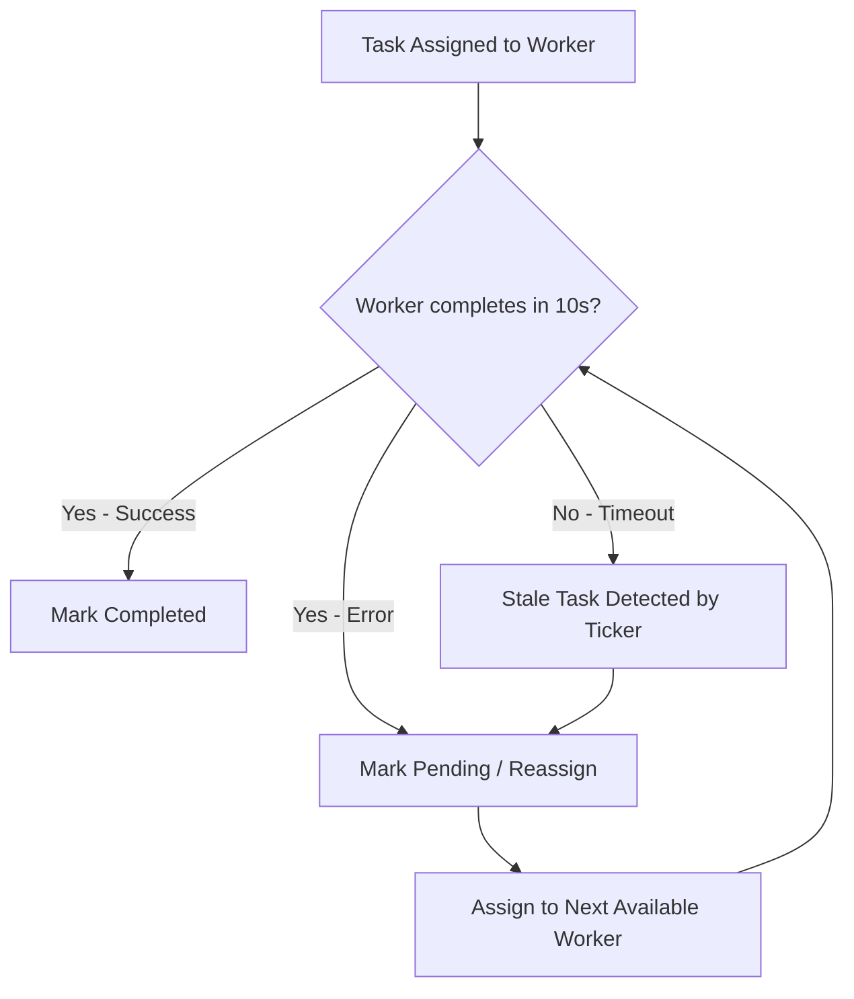

# Large-Scale Distributed Systems: Raft-Based Key-Value Cache & Distributed MapReduce

> A distributed systems project implementing two foundational pillars of large-scale infrastructure: a **replicated key-value cache** powered by the Raft consensus protocol, and a **fault-tolerant MapReduce** framework with parallel task execution — built entirely in Go.

---

## Table of Contents

- [Overview](#overview)
- [Motivation](#motivation)
- [Features](#features)
- [System Architecture](#system-architecture)
- [Raft-Based Key-Value Cache](#raft-based-key-value-cache)
- [Distributed MapReduce](#distributed-mapreduce)
- [Architecture Diagrams](#architecture-diagrams)
- [Tech Stack](#tech-stack)
- [Project Structure](#project-structure)
- [Installation](#installation)
- [How to Run](#how-to-run)
- [Example Usage](#example-usage)
- [Testing](#testing)
- [Failure Handling](#failure-handling)
- [Concurrency and Synchronization](#concurrency-and-synchronization)
- [Performance Discussion](#performance-discussion)
- [Limitations](#limitations)
- [Future Improvements](#future-improvements)
- [What I Learned](#what-i-learned)
- [Resume Bullet Points / Interview Highlights](#resume-bullet-points--interview-highlights)

---

## Overview

This project consists of two independent but complementary distributed systems components:

1. **Raft-Based Key-Value Cache** — A replicated, linearizable key-value store using leader-follower replication with the Raft consensus protocol. Supports `Get`, `Put`, and `Append` operations with automatic leader election, log replication, and crash recovery.

2. **Distributed MapReduce** — A master-worker MapReduce framework that splits input data across parallel map tasks, partitions intermediate results, and aggregates them through reduce tasks — with built-in fault tolerance via task timeouts and reassignment.

Both systems are implemented in Go, leveraging goroutines, channels, mutexes, and RPC for concurrent, fault-tolerant distributed coordination.

---

## Motivation

Modern distributed infrastructure — from databases like CockroachDB and etcd to data processing engines like Hadoop and Spark — is built on consensus protocols and parallel computation frameworks. This project implements these two foundational abstractions from scratch to develop deep, hands-on understanding of:

- **Consensus and replication**: How distributed nodes agree on a single source of truth despite failures.
- **Fault-tolerant task scheduling**: How large-scale data processing systems handle worker crashes, stragglers, and partial failures.
- **Concurrency in distributed systems**: How to safely coordinate goroutines, RPCs, and shared state under concurrent access.

This is an academic-scale prototype that demonstrates real large-scale systems concepts — not a production deployment.

---

## Features

### Raft Consensus & Key-Value Cache
- ✅ Leader election with randomized election timeouts
- ✅ Log replication with majority-based commit
- ✅ `Get`, `Put`, and `Append` client operations
- ✅ RequestVote and AppendEntries RPCs (per Raft paper Figure 2)
- ✅ Heartbeat mechanism for leader authority
- ✅ Persistent state for crash recovery (`currentTerm`, `votedFor`, `log[]`)
- ✅ Commit index advancement and log consistency checks
- ✅ Handles leader crashes, follower crashes, stale leaders, and network partitions

### Distributed MapReduce
- ✅ Master-worker architecture with RPC-based task assignment
- ✅ Parallel map and reduce phase execution
- ✅ Intermediate file partitioning via `hash(key) % nReduce`
- ✅ Fault tolerance through 10-second task timeouts and reassignment
- ✅ Atomic output file writes via temporary file renaming
- ✅ Pluggable map/reduce functions loaded as Go plugins (`.so`)
- ✅ Comprehensive test suite: word count, indexer, parallelism, crash recovery

---

## System Architecture



---

## Raft-Based Key-Value Cache

### API Operations

The KV cache exposes three client operations, all linearizable:

| Operation | Description |
|-----------|-------------|
| `Get(key)` | Returns the current value for the key, or `""` if not found |
| `Put(key, value)` | Sets the value for the key, overwriting any previous value |
| `Append(key, value)` | Appends the value to the existing value for the key |

```go
// Client usage
clerk := kvraft.MakeClerk(servers)
clerk.Put("x", "100")
clerk.Append("x", "200")
value := clerk.Get("x") // returns "100200"
```

### Leader Election

- Each node starts as a **Follower** and waits for heartbeats from a leader.
- If no heartbeat is received within a **randomized election timeout** (150–350ms), the node transitions to **Candidate** and initiates an election.
- The candidate increments its `currentTerm`, votes for itself, and sends `RequestVote` RPCs to all peers.
- A candidate becomes **Leader** upon receiving votes from a **majority** of nodes.
- The randomized timeout minimizes split-vote scenarios.

### Log Replication

- Client write requests (`Put`/`Append`) are routed to the leader.
- The leader appends the command to its local log and replicates it to followers via `AppendEntries` RPCs.
- Each `AppendEntries` RPC carries the leader's `prevLogIndex` and `prevLogTerm` for **log consistency checks**.
- Followers reject entries that don't match, and the leader retries with decremented `nextIndex` until consistency is achieved.

### Commit and Apply Flow

```
Client Request → Leader Log Append → Replicate to Followers
     → Majority Acknowledge → Advance commitIndex
     → Apply to State Machine → Respond to Client
```

- Once a majority of nodes have replicated a log entry, the leader advances its `commitIndex`.
- Each node runs an **apply loop** that monitors `commitIndex` and applies committed entries to the key-value state machine via the `applyCh` channel.

### Crash Recovery

- **Persistent state** (`currentTerm`, `votedFor`, `log[]`) is saved to stable storage before responding to RPCs.
- On restart, nodes restore state from the `Persister` and resume participation in the cluster.
- The Raft protocol guarantees that committed entries are never lost, even across leader crashes.

### Concurrency Model

| Primitive | Usage |
|-----------|-------|
| `sync.Mutex` | Protects shared Raft state (term, log, vote) |
| `goroutines` | Election timer, heartbeat loop, apply loop, RPC handlers |
| `channels` | `applyCh` delivers committed entries to the KV state machine |
| `sync/atomic` | Lock-free `Kill()` / `killed()` checks for graceful shutdown |

---

## Distributed MapReduce

### Master-Worker Design

The system follows Google's original MapReduce paper architecture:

- **Coordinator (Master)**: Manages the lifecycle of all map and reduce tasks. Tracks task status (`Pending` → `InProgress` → `Completed`), assigns tasks to workers on demand, and monitors for stale/crashed workers.
- **Workers**: Stateless processes that repeatedly request tasks from the coordinator, execute map or reduce logic, write outputs, and report completion.
- Communication uses **Go's `net/rpc`** over Unix domain sockets.

### Map Phase

1. The coordinator splits input files into individual map tasks.
2. Each worker requests a task via `GetTask` RPC and receives an input file.
3. The worker reads the file, calls the user-defined `Map` function, and partitions output key-value pairs into `nReduce` intermediate files using `ihash(key) % nReduce`.
4. Intermediate files are named `mr-{mapTaskNumber}-{reducePartition}`.
5. Upon completion, the worker reports back via `PerformTaskCb` RPC with the list of intermediate files.

```go
// Intermediate file partitioning
partitionKey := ihash(kv.Key) % nReducer
intermediateFilename := fmt.Sprintf("mr-%d-%d", task.MapTaskNumber, i)
```

### Reduce Phase

1. Reduce tasks begin only after **all** map tasks are complete.
2. Each reduce task receives the set of intermediate files for its partition.
3. The worker reads all intermediate files, sorts by key, groups values by key, and calls the user-defined `Reduce` function.
4. Output is written atomically: first to a temporary file, then renamed to `mr-out-{reduceTaskNumber}`.

```go
// Atomic output write
tempFile, _ := os.CreateTemp(".", oname)
// ... write reduce output ...
os.Rename(tempFile.Name(), oname)
```

### Fault Tolerance and Task Reassignment

- The coordinator runs a **background ticker** (every 1 second) that checks for stale tasks.
- If a task has been `InProgress` for more than **10 seconds**, it is marked as `Pending` and eligible for reassignment.
- This handles worker crashes, network failures, and slow stragglers.
- Error responses from workers also trigger task reassignment.

```go
func (c *Coordinator) CheckForStaleTasks() {
    for key, value := range c.mapTasks {
        if value.status == InProgress && time.Now().Unix() > (value.startTime + 10) {
            c.mapTasks[key] = Task{startTime: math.MinInt64, status: Pending}
        }
    }
    // Same for reduceTasks...
}
```

### Intermediate File Partitioning

```
Input File → Map → hash(key) % nReduce → Intermediate Files → Reduce → Output

                    ┌─── mr-0-0 ───┐
  pg-*.txt → Map 0 ─┤── mr-0-1 ───┤
                    └─── mr-0-2 ───┘     ┌─ mr-out-0
                    ┌─── mr-1-0 ───┐     │
  pg-*.txt → Map 1 ─┤── mr-1-1 ───┼─────┼─ mr-out-1
                    └─── mr-1-2 ───┘     │
                                         └─ mr-out-2
```

---

## Architecture Diagrams

### Raft Replication Flow



### Raft Node State Transitions



### MapReduce Task Lifecycle



### MapReduce Fault Tolerance Flow



---

## Tech Stack

| Technology | Purpose |
|------------|---------|
| **Go 1.15+** | Primary implementation language |
| **Go RPC (`net/rpc`)** | Inter-process communication (MapReduce) |
| **Lab RPC (`labrpc`)** | Simulated RPC with network fault injection (Raft) |
| **Goroutines** | Concurrent election timers, heartbeats, apply loops, workers |
| **Channels** | `applyCh` for delivering committed log entries |
| **`sync.Mutex`** | Protecting shared state in Raft nodes and coordinator |
| **`sync/atomic`** | Lock-free kill/shutdown signaling |
| **Go Plugins** | Dynamically loaded Map/Reduce functions (`.so` files) |
| **JSON** | Intermediate file encoding for MapReduce |
| **FNV Hash** | Deterministic key partitioning (`ihash`) |

---

## Project Structure

```
MapReduce_Raft/
└── Raft/
    ├── Makefile
    ├── documentation/
    │   └── lab-1-mapreduce/
    │       ├── README.md
    │       ├── master-flowchart.jpg
    │       └── worker-flowchart.jpg
    └── src/
        ├── go.mod
        ├── raft/                  # Raft consensus implementation
        │   ├── raft.go            # Core Raft logic (election, replication, apply)
        │   ├── persister.go       # Persistent state storage
        │   ├── config.go          # Test configuration & cluster setup
        │   ├── test_test.go       # Comprehensive Raft test suite
        │   └── util.go            # Debug utilities
        ├── kvraft/                # Raft-backed key-value server
        │   ├── server.go          # KVServer with Get/Put/Append handlers
        │   ├── client.go          # Clerk (client) with leader discovery
        │   ├── common.go          # Shared types (args, replies, errors)
        │   ├── config.go          # Test configuration
        │   └── test_test.go       # KV service test suite
        ├── mr/                    # MapReduce framework
        │   ├── coordinator.go     # Master: task scheduling & fault tolerance
        │   ├── worker.go          # Worker: map/reduce execution
        │   └── rpc.go             # RPC type definitions
        ├── mrapps/                # Pluggable MapReduce applications
        │   ├── wc.go              # Word count
        │   ├── indexer.go         # Inverted index
        │   ├── crash.go           # Crash simulation for testing
        │   ├── nocrash.go         # Non-crashing baseline
        │   ├── mtiming.go         # Map parallelism test
        │   ├── rtiming.go         # Reduce parallelism test
        │   ├── jobcount.go        # Job count verification
        │   └── early_exit.go      # Early exit test
        ├── main/                  # Entry points & test data
        │   ├── mrcoordinator.go   # Coordinator entry point
        │   ├── mrworker.go        # Worker entry point
        │   ├── mrsequential.go    # Sequential MapReduce (baseline)
        │   ├── test-mr.sh         # MapReduce test suite script
        │   └── pg-*.txt           # Project Gutenberg input texts
        ├── labrpc/                # Simulated RPC with fault injection
        ├── labgob/                # Encoding utilities
        └── porcupine/             # Linearizability checker
```

---

## Installation

### Prerequisites

- **Go** 1.15 or later — [Install Go](https://go.dev/doc/install)
- **Linux or macOS** (Go plugin support requires Unix-like OS)
- **bash** for running test scripts

### Clone & Setup

```bash
git clone https://github.com/<your-username>/MapReduce_Raft.git
cd MapReduce_Raft/Raft/src
```

> **Note:** Exact setup commands may vary depending on your local Go environment and repository structure.

---

## How to Run

### MapReduce — Word Count Example

**1. Build the word count plugin:**

```bash
cd src/mrapps
go build -buildmode=plugin wc.go
```

**2. Run the sequential baseline (for correctness comparison):**

```bash
cd src/main
go run mrsequential.go ../mrapps/wc.so pg-*.txt
```

**3. Run the distributed version:**

```bash
# Terminal 1: Start the coordinator
cd src/main
go run mrcoordinator.go pg-*.txt

# Terminal 2, 3, 4: Start workers (one per terminal)
cd src/main
go run mrworker.go ../mrapps/wc.so
```

**4. Check output:**

```bash
cat mr-out-* | sort | head -20
```

### Raft — Run Tests

```bash
cd src/raft
go test -run 3A        # Leader election tests
go test -run 3B        # Log replication tests
go test -run 3C        # Persistence tests
go test -run 3D        # Snapshot tests
go test -race          # Run all tests with race detector
```

### KV Raft — Run Tests

```bash
cd src/kvraft
go test -race
```

---

## Example Usage

### Word Count MapReduce Application

The included `wc.go` plugin demonstrates the programming model:

```go
// Map: emit (word, "1") for each word in the document
func Map(filename string, contents string) []mr.KeyValue {
    words := strings.FieldsFunc(contents, func(r rune) bool {
        return !unicode.IsLetter(r)
    })
    kva := []mr.KeyValue{}
    for _, w := range words {
        kva = append(kva, mr.KeyValue{w, "1"})
    }
    return kva
}

// Reduce: count occurrences of each word
func Reduce(key string, values []string) string {
    return strconv.Itoa(len(values))
}
```

**Sample output (`mr-out-*`):**

```
A 509
ABOUT 2
ACT 8
ACTUAL 8
ADLER 1
ADVENTURE 12
...
the 33789
to 16415
of 14827
and 13590
```

---

## Testing

### MapReduce Test Suite

The project includes a comprehensive bash test script (`test-mr.sh`) that validates:

| Test | What It Validates |
|------|-------------------|
| **Word Count** | Correctness against sequential baseline |
| **Indexer** | Inverted index correctness |
| **Map Parallelism** | Multiple map tasks run concurrently |
| **Reduce Parallelism** | Multiple reduce tasks run concurrently |
| **Job Count** | Correct number of map tasks executed |
| **Early Exit** | No worker/coordinator exits before completion |
| **Crash Recovery** | Correct output despite random worker crashes |

```bash
cd src/main
bash test-mr.sh
# Expected: *** PASSED ALL TESTS
```

### Raft Test Suite

```bash
cd src/raft
go test -v -count=1       # Verbose single run
go test -count=10 -race    # Multiple runs with race detection
```

---

## Failure Handling

### Raft — Fault Scenarios

| Scenario | How It's Handled |
|----------|-----------------|
| **Leader crash** | Followers detect missing heartbeats, trigger election, elect new leader |
| **Follower crash** | Leader retries `AppendEntries`; follower recovers state from persister |
| **Network partition** | Stale leaders cannot commit (no majority); new leader elected in majority partition |
| **Split vote** | Randomized election timeouts ensure quick resolution |
| **Stale leader** | Discovers higher term from RPC response, steps down to follower |
| **Log inconsistency** | Leader decrements `nextIndex` and retries until follower's log matches |

### MapReduce — Fault Scenarios

| Scenario | How It's Handled |
|----------|-----------------|
| **Worker crash** | 10-second timeout triggers task reassignment to another worker |
| **Slow worker (straggler)** | Same timeout mechanism; task is reassigned |
| **Worker error** | Worker reports error; coordinator marks task as `Pending` for retry |
| **Partial output** | Atomic rename ensures only complete output files are visible |
| **Coordinator crash** | Not handled (single point of failure — see [Limitations](#limitations)) |

---

## Concurrency and Synchronization

### Raft Concurrency Architecture

```
┌─────────────────────────────────────────────────┐
│                  Raft Node                       │
│                                                  │
│  ┌──────────┐  ┌──────────────┐  ┌───────────┐  │
│  │ Ticker   │  │ Heartbeat    │  │ Apply     │  │
│  │ Goroutine│  │ Goroutine    │  │ Goroutine │  │
│  │          │  │ (leader only)│  │           │  │
│  └────┬─────┘  └──────┬───────┘  └─────┬─────┘  │
│       │               │                │         │
│       └───────┬───────┴────────┬───────┘         │
│               │                │                 │
│         sync.Mutex        applyCh                │
│         (shared state)    (channel)              │
│                                                  │
└─────────────────────────────────────────────────┘
```

- **Ticker goroutine**: Monitors election timeout; triggers candidacy if no heartbeat received.
- **Heartbeat goroutine**: Leader sends periodic `AppendEntries` RPCs to maintain authority.
- **Apply goroutine**: Watches `commitIndex` and delivers committed entries via `applyCh`.
- **Mutex**: All shared state access (`term`, `log`, `votedFor`, `commitIndex`) is serialized.
- **Atomic operations**: `Kill()` / `killed()` use `sync/atomic` for lock-free shutdown checks.

### MapReduce Concurrency

- The coordinator uses a `sync.Mutex` to serialize access to task maps (`mapTasks`, `reduceTasks`).
- Workers run independently as separate OS processes — no shared memory.
- The coordinator's `StartTicker()` goroutine periodically scans for stale tasks.

---

## Performance Discussion

### MapReduce Parallelism

The distributed MapReduce implementation reduces end-to-end execution time compared to sequential execution by parallelizing both map and reduce phases across multiple worker processes.

- **Map parallelism**: Multiple input files are processed concurrently by different workers. The test suite validates that map tasks run in parallel (see `mtiming.go`).
- **Reduce parallelism**: Multiple reduce partitions are processed concurrently. Validated by `rtiming.go`.
- **Speedup**: Proportional to the number of workers, bounded by the number of tasks and I/O overhead. Exact speedup depends on input size, number of workers, and system resources.

> **Note:** No synthetic benchmark numbers are provided. The parallelism tests in the test suite empirically verify concurrent execution.

### Raft Performance Characteristics

- **Election convergence**: Randomized timeouts (150–350ms) minimize split votes, enabling leader election within 1–2 rounds in most cases.
- **Commit latency**: Bounded by the round-trip time to a majority of nodes plus local apply time.
- **Throughput**: Limited by the leader's ability to batch and replicate log entries. In this prototype, entries are replicated individually.

---

## Limitations

| Limitation | Description |
|------------|-------------|
| **Single coordinator** | MapReduce coordinator is a single point of failure |
| **No log compaction** | Raft log grows unbounded without snapshotting (3D is framework-only) |
| **In-memory state** | KV store and coordinator state are held in memory |
| **No dynamic membership** | Raft cluster membership is fixed at startup |
| **No authentication** | RPC communication is unauthenticated |
| **Plugin system** | Go plugins (`.so`) are Linux/macOS only, not supported on Windows |
| **No persistent MapReduce state** | Coordinator loses all state on crash |
| **Simulated network** | Raft tests use `labrpc` (simulated network), not real TCP/gRPC |

---

## Future Improvements

- [ ] **Log compaction / snapshots**: Implement Raft snapshot protocol to bound log growth
- [ ] **Real gRPC transport**: Replace `labrpc` with production gRPC for Raft communication
- [ ] **Sharded KV store**: Partition keys across multiple Raft groups for horizontal scaling
- [ ] **Coordinator replication**: Run the MapReduce coordinator as a Raft-replicated service
- [ ] **Speculative execution**: Launch backup tasks for slow map/reduce stragglers
- [ ] **Dynamic cluster membership**: Support adding/removing Raft nodes at runtime
- [ ] **Persistent KV state**: Add disk-backed storage with WAL for the key-value store
- [ ] **Metrics and observability**: Add Prometheus metrics for Raft leader elections, commit latency, and MapReduce task throughput
- [ ] **Batch log replication**: Replicate multiple log entries per `AppendEntries` RPC for higher throughput

---

## What I Learned

### Distributed Consensus
- Implementing Raft from the paper revealed the subtlety of correctness in distributed systems — every edge case (stale leaders, log conflicts, split votes) requires careful handling.
- The gap between understanding the Raft paper and implementing it correctly is significant. Bugs often manifest as rare race conditions that only appear under stress testing.

### Fault Tolerance
- Designing for failure is fundamentally different from designing for the happy path. The coordinator's stale-task ticker and the Raft persister exist solely for failure recovery.
- Atomic file operations (temp file + rename) prevent partial output corruption — a pattern used extensively in production systems.

### Concurrency in Go
- Go's concurrency model (goroutines + channels + mutexes) maps naturally to distributed systems patterns: background election timers, heartbeat loops, and apply channels.
- Race conditions in Raft are notoriously subtle. The Go race detector (`-race` flag) was indispensable for finding concurrency bugs.

### Systems Thinking
- MapReduce's simplicity is deceptive. The coordinator must carefully sequence phases (all maps before any reduces), handle partial failures, and avoid duplicate work.
- Raft's "simple" leader election requires handling dozens of edge cases: what happens when a candidate receives a heartbeat? When a leader discovers a higher term? When two nodes have conflicting logs?

---

## Resume Bullet Points / Interview Highlights

> Use these as starting points for resume bullet points or interview talking points.

- **Engineered a distributed key-value cache in Go** using the Raft consensus protocol with leader election, log replication, and majority-based commit for strong consistency across a replicated cluster.

- **Implemented the Raft consensus algorithm** including `RequestVote` RPC, `AppendEntries` RPC, randomized election timeouts, persistent state recovery, commit index advancement, and log consistency checks — handling leader crashes, follower failures, and split-vote scenarios.

- **Built a fault-tolerant distributed MapReduce framework** with a master-worker architecture, supporting parallel map/reduce execution, intermediate file partitioning via consistent hashing, and automatic task reassignment upon worker crash or timeout.

- **Designed concurrent coordination infrastructure** using Go goroutines, channels, and mutexes to manage election timers, heartbeat loops, RPC handlers, and apply loops — validated with Go's race detector under stress testing.

- **Achieved fault tolerance in MapReduce** through 10-second task timeouts, stale task detection via a background ticker goroutine, atomic output file writes, and error-driven task reassignment — passing crash recovery and parallelism test suites.

- **Reduced MapReduce execution time** compared to sequential baseline by parallelizing map and reduce phases across multiple concurrent worker processes with RPC-based task scheduling.

---

## License

This project is for educational and portfolio purposes.

---

<p align="center">
  <i>Built with Go • Inspired by the Raft paper (Ongaro & Ousterhout, 2014) and Google's MapReduce paper (Dean & Ghemawat, 2004)</i>
</p>
